# RAG Complaint Retrieval System

A Retrieval-Augmented Generation (RAG) system for searching and analyzing consumer complaint narratives using semantic search, vector databases, reranking, and large language models.

## Demo

A demonstration of the Streamlit application is available below.
[Download Demo Video](assets/demo/demo.mov)

## Key Features

* Semantic search using BAAI/bge-small-en-v1.5 embeddings
* PostgreSQL + pgvector vector database
* Multiple chunking strategies:

  * Fixed-size chunking
  * Recursive chunking
  * Token-aware semantic chunking
* Metadata filtering (Product, State, Company)
* Cross-encoder reranking
* AI-generated complaint overviews using a local Ollama model
* Streamlit user interface

## Dataset

This project uses the Consumer Financial Protection Bureau (CFPB) Consumer Complaint Database.
Dataset statistics:

- Total complaints: 3.58 million
- Complaints containing narratives: 1.29 million
- Retrieval corpus after deduplication: 1.22 million
- Embedding model: BAAI/bge-small-en-v1.5
- Vector database: PostgreSQL + pgvector

## Architecture

The system follows a Retrieval-Augmented Generation (RAG) pipeline:

1. Consumer complaints are cleaned and deduplicated.
2. Complaint narratives are chunked using one of three chunking strategies:
   - Fixed-size chunking
   - Recursive chunking
   - Token-aware semantic chunking
3. Chunks are embedded using BAAI/bge-small-en-v1.5.
4. Embeddings are stored in PostgreSQL using pgvector.
5. User queries are embedded and matched through vector similarity search.
6. Optional metadata filters narrow the search space.
7. Optional cross-encoder reranking improves ranking quality.
8. A local LLM generates an overview of the retrieved complaints.
9. Results are displayed through a Streamlit interface.

## Application Screenshots

The screenshots below demonstrate the major capabilities of the system, including semantic retrieval, metadata filtering, reranking, AI-generated summaries, conversation-aware retrieval, and chunking strategy comparisons.

### Main Interface

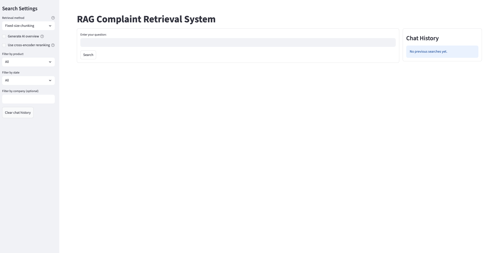

The Streamlit interface allows users to search consumer complaints using semantic retrieval, metadata filtering, reranking, and AI-generated summaries.

### Vector Search Results

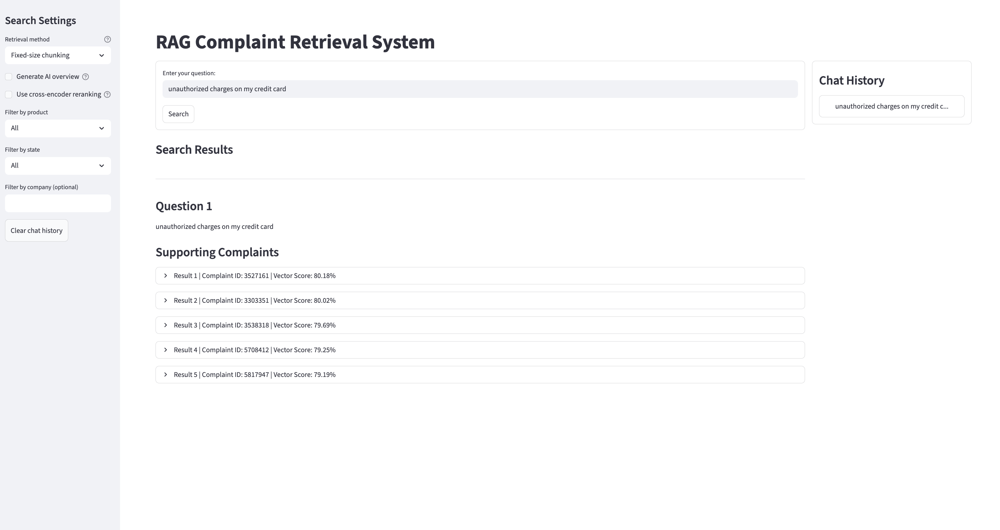

Baseline semantic retrieval using BAAI/bge-small-en-v1.5 embeddings and PostgreSQL pgvector similarity search.

### Metadata-Filtered Retrieval

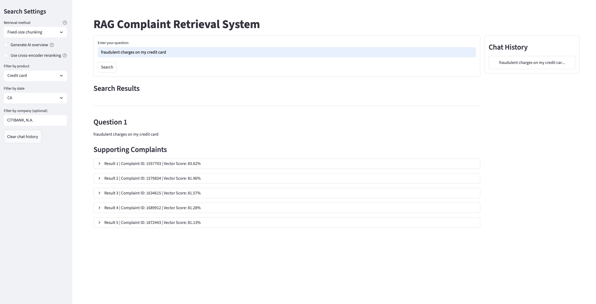

Semantic retrieval combined with metadata filtering by product, state, and company.

### Cross-Encoder Reranking

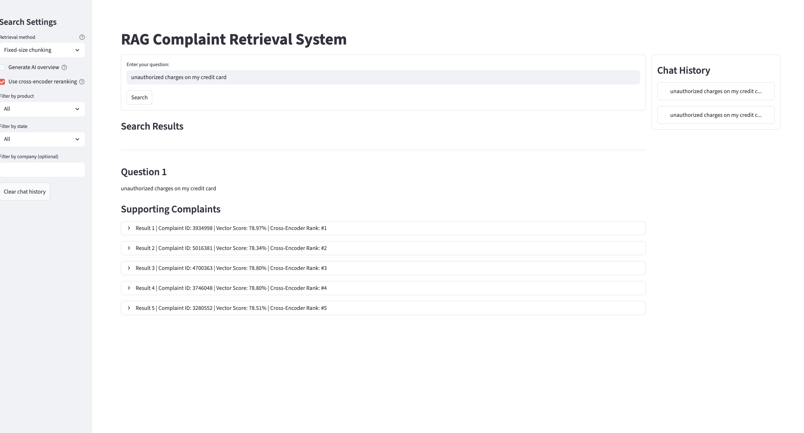

Retrieved complaints are reranked using a cross-encoder model to improve ranking quality.

### AI-Generated Overview

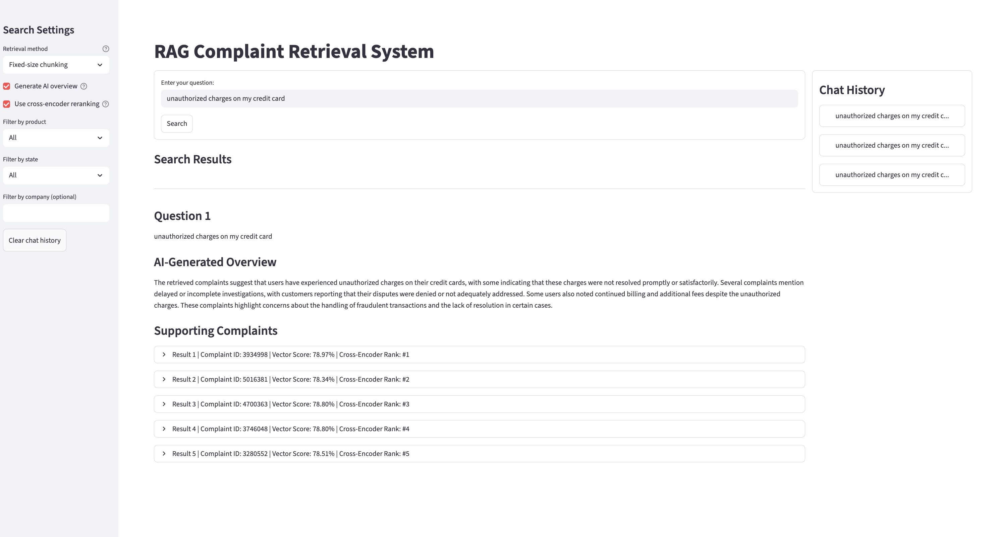

A local LLM generates a concise overview summarizing themes across the retrieved complaints.

### Complaint Inspection

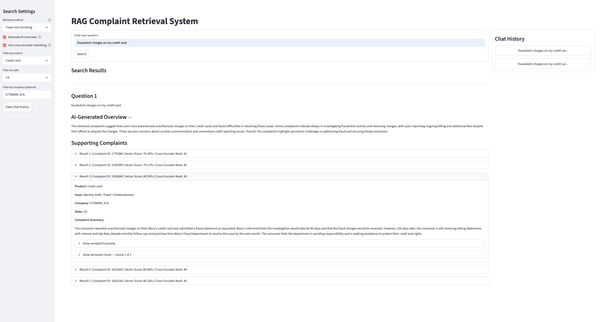

Retrieved complaints expose metadata, generated summaries, and supporting evidence used during retrieval.

### Chunk and Complaint Preview

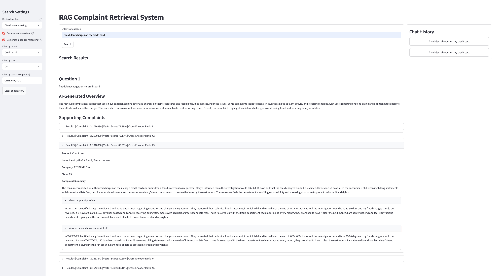

Retrieved chunks and original complaint narratives can be examined for transparency and debugging.

### Conversation-Aware Retrieval

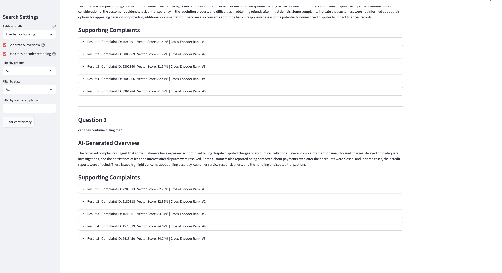

Retrieval queries are automatically enhanced using recent conversation history, enabling context-aware follow-up questions.

## Chunking Strategy Comparison

The project evaluates three chunking approaches:

1. Fixed-size chunking
2. Recursive chunking
3. Token-aware semantic chunking

### Fixed-Size Chunking

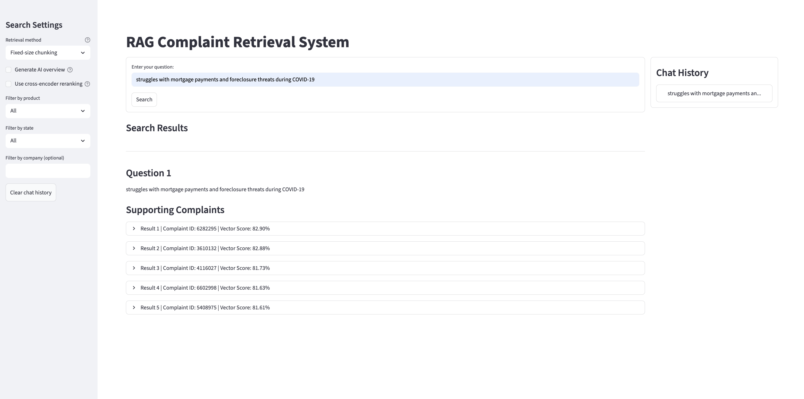

### Recursive Chunking

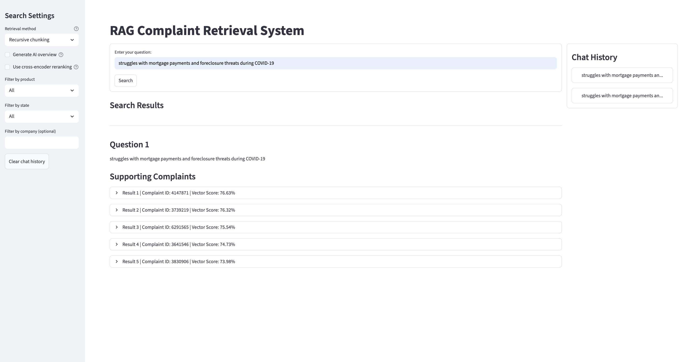

### Token-Aware Semantic Chunking

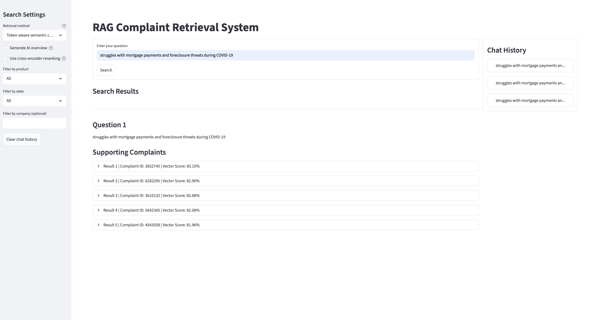

## Evaluation

The project evaluates retrieval quality across multiple chunking strategies:

- Fixed-size chunking
- Recursive chunking
- Token-aware semantic chunking

Retrieval performance was assessed using:

- LLM-as-a-Judge evaluation
- Cross-encoder relevance scoring

The evaluation framework enables systematic comparison of retrieval quality across different preprocessing approaches.

## Technologies

* Python
* Streamlit
* PostgreSQL
* pgvector
* Sentence Transformers
* Cross Encoder Reranking
* Ollama
* Pandas
* NumPy

## Running the Application

```bash
pip install -r requirements.txt
streamlit run app/app.py
```

## Project Structure

* `app/` — Streamlit application
* `notebooks/` — Data preprocessing, chunking, and embedding generation
* `scripts/` — Data loading and utility scripts
* `evaluation/` — Retrieval and reranking evaluation experiments
* `sql/` — Database schema and setup files

